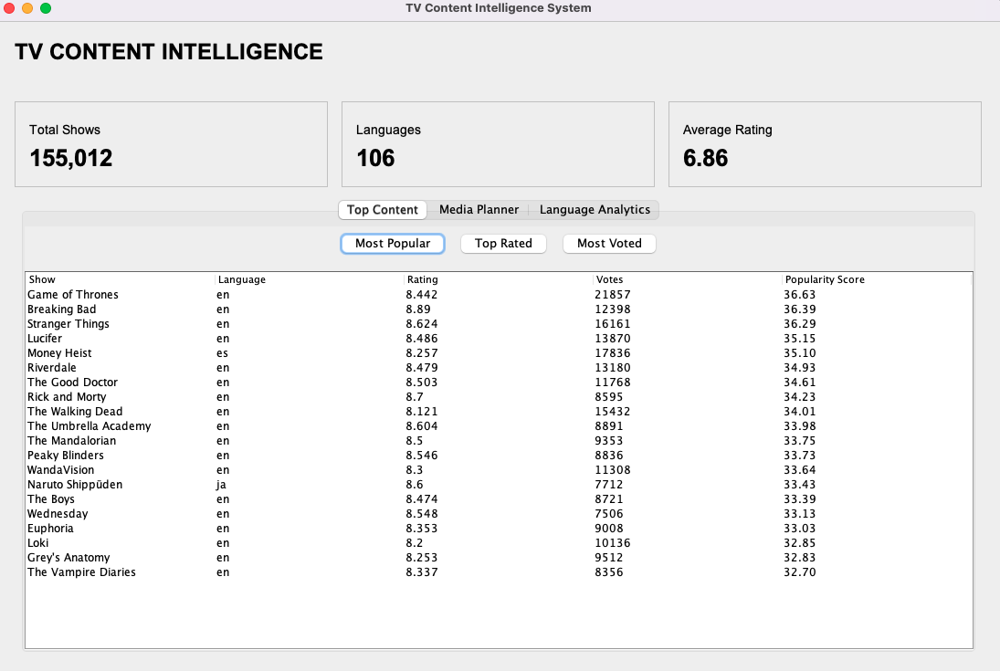
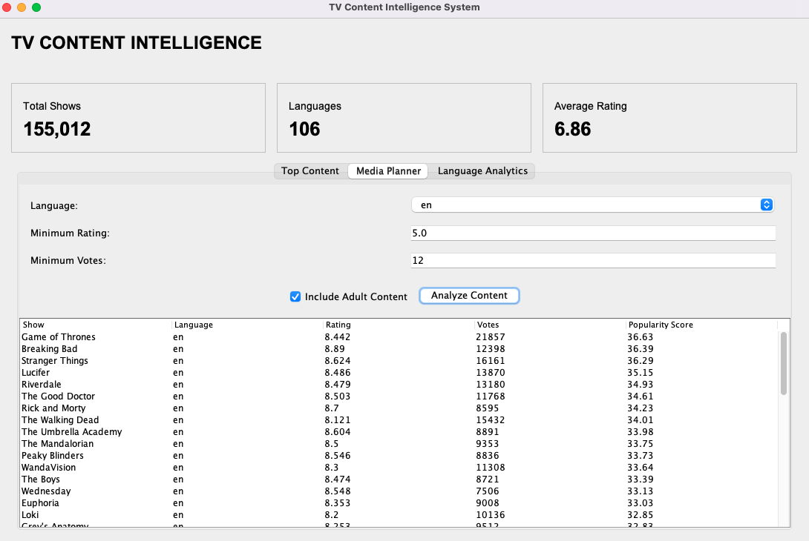

# TV Content Intelligence & Media Planning System

A Java-based TV content analytics and media planning system that processes **155K+ TV shows** from TMDB-derived metadata to identify high-performing content, analyze catalog trends, and support rule-based media planning.

Built around the **Media Planning** and **Gracenote Content Metadata** domains relevant to Nielsen.

---

## Dashboard

### Main Dashboard



### Media Planner



### Content Analytics


> Screenshots show the Java Swing desktop application used to explore the TV content catalog and generate media-planning recommendations.

---

## Key Features

### Content Catalog Analytics

Processes **155,012 TV shows** and analyzes:

- Average content rating
- Vote volume
- Number of seasons
- Number of episodes
- Original language
- Adult/non-adult content
- Content popularity

### Popularity Scoring

A custom engagement-aware popularity metric combines rating quality with vote volume:

```text
Popularity Score =
Vote Average × log10(1 + Vote Count)